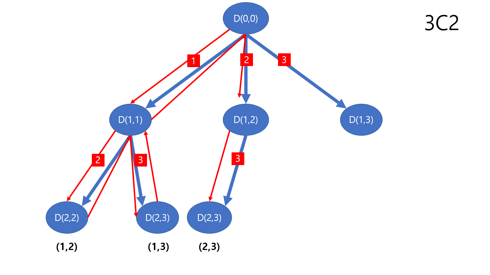

# 재귀함수 - 조합
> n개의 원소 중 r개를 뽑아 중복을 허용하지 않으며 순서는 고려하지 않은 조합을 나열하는 것

## 풀이
> n개의 숫자 중 r개를 뽑아 순서와 상관없이 만들 수 있는 모든 조합을 구하는 것으로서,<br/>
> 반복문을 사용하여 구할수도 있지만 재귀함수를 사용한다면 가독성과 수정에 용이하다.

### 예를 들어 설명하자면
```java
int[] N = {1, 2, 3};
```
위 배열에서 2개를 뽑아 만들 수 있는 **순열**은 아래와 같다.
> {1, 2}, {1, 3}, {2, 1}, {2, 3}, {3, 1}, {3, 2}

구성 요소 뿐 아니라 순서도 고려하기 때문이다.

반면, 위 배열에서 2개를 뽑아 만들 수 있는 **조합**을 구한다면 결과는 아래와 같다.
> {1, 2}, {1, 3}, {2, 3}

조합만 고려하기 때문이다.

## 수학공식
n개의 숫자 중 r개를 뽑아 만들 수 있는 모든 순열의 개수를 구하는 공식은 아래와 같다.<br />
아래 공식에서 `P`는 순열을 뜻하는 단어인 `permute`의 약자이다.
>nCr = nPr / r!<br/>
>nPr = n! / (n-r)!

[위의 예시](#예를-들어-설명하자면)를 보며, 3개의 숫자 중 2개를 뽑아 만들 수 있는 조합의 개수를 구하자면 아래와 같다.
>3C2<br/>
>= 3P2 / 2!<br/>
>= (3! / (3 - 2)!) / 2!<br/>
>= (3! / 1!) / 2!<br/>
>= ((3 * 2 * 1) / 1) / 2!<br/>
>= (6 / 1) / 2!<br/>
>= 6 / 2!<br/>
>= 6 / (2 * 1)<br/>
>= 6 / 2<br/>
>= 3

## 알고리즘으로는 어떻게 구현할까
DFS(깊이 우선 탐색으로서 나중에 더 다뤄볼 예정)를 이용하여 풀 수 있다. 아래 그림을 보면 더 좋을 것 같다.


### 몇가지 법칙을 찾을 수 있다.

**1. 최대 깊이에 도달할 시 탐색 종료 및 이전 깊이로 돌아간다.** 

그리고 탐색이 최대 깊이에 도달했다면 더이상 탐색을 진행하지 않고
이전 깊이로 돌아가서 탐색을 진행했던 가지의 다음 가지에서 나올 수 있는 경우의 수를 탐색한다.

**2. depth + 1, 현재 요소의 인덱스 + 1**

각 가지(branch)로부터 그 다음에 올 수 있는 모든 경우의 수로 가지가 뻗어나가고 있다.<br/>
아래로 내려갈 수록 깊이(depth)가 깊어지고 있으며, 요소는 중복 없이, 순열 상관 없이 다음 요소로 넘어가야 하므로 depth + 1, 현재 요소의 인덱스 + 1 를 인자로 넘겨준다.

### 구현
위 세 가지의 법칙들을 모두 적용하면 아래와 같은 모습이 나올 것이다.<br/>
1234 네개의 숫자로 만들 수 있는 모든 조합을 구하는 문제를 푼 파일로 가 직접 확인해보도록 하자.<br/>
[해당 파일로 이동](./Combination.java)
```java
public class Combination {
    private final int[] N = {1, 2, 3, 4};
    private final int R = 2;

    private final int[] result = new int[R];

    private void DFS (int depth, int begin) {
        if(depth == R){
            System.out.println(Arrays.toString(result));
            return;
        }

        for (int i = begin; i < N.length; i++) {
            result[depth] = N[i];
            DFS(depth + 1, i + 1);
        }
    }

    void solve () {
        DFS(0, 0);
    }

    public static void main(String[] args) {
        Combination combination = new Combination();
        combination.solve();
    }
}
```

## 참고
* https://www.youtube.com/watch?v=HYKpunR1Nto
* https://www.youtube.com/watch?v=7L8OzmSUXWo&t=9s