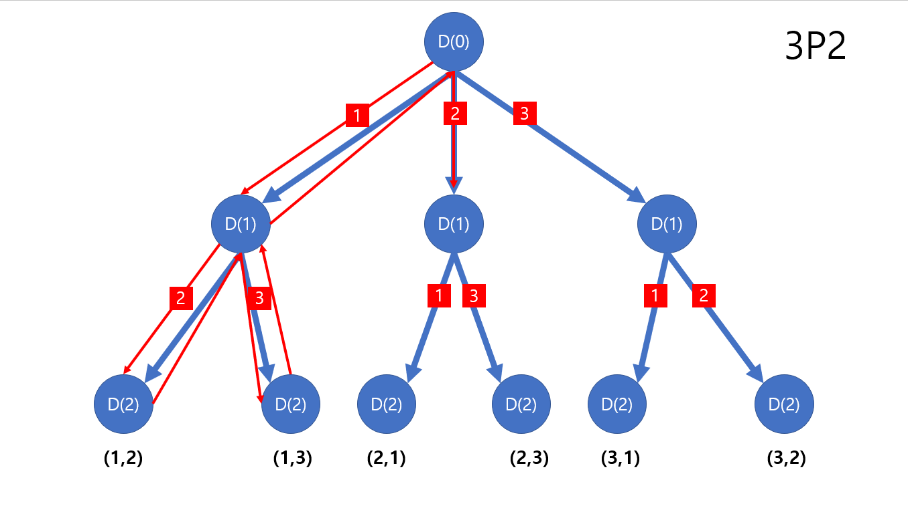

# 재귀함수 - 순열
> n개의 원소 중 r개를 뽑아 중복을 허용하지 않을 뿐 아니라 순서를 고려한 조합을 나열하는 것  

## 풀이
> n개의 숫자 중 r개를 뽑아 만들 수 있는 모든 순열을 구하는 것으로서,<br/>
> 반복문을 사용하여 구할수도 있지만 재귀함수를 사용한다면 가독성과 수정에 용이하다.

### 예를 들어 설명하자면
```java
int[] N = {1, 2, 3};
```
위 배열에서 2개를 뽑아 만들 수 있는 **조합**을 구한다면 
> {1, 2}, {1, 3}, {2, 3}

이것이 전부일 것이다. 순서는 상관이 없고 구성 요소만 고려하기 때문이다.

반면, 위 배열에서 2개를 뽑아 만들 수 있는 **순열**을 구한다면 결과는 아래와 같다.
> {1, 2}, {1, 3}, {2, 1}, {2, 3}, {3, 1}, {3, 2}

조합 + 순서까지 고려하기 때문이다. 

## 수학공식
n개의 숫자 중 r개를 뽑아 만들 수 있는 모든 순열의 개수를 구하는 공식은 아래와 같다.<br />
아래 공식에서 `P`는 순열을 뜻하는 단어인 `permute`의 약자이다.
> nPr = n! / (n-r)!

[위의 예시](#예를-들어-설명하자면)를 보며, 3개의 숫자 중 2개를 뽑아 만들 수 있는 순열의 개수를 구하자면 아래와 같다.
>3P2<br/>
>= 3! / (3 - 2)!<br/>
>= 3! / 1!<br/>
>= (3 * 2 * 1) / 1<br/>
>= 6 / 1<br/>
>= 6

## 순열은 언제 사용할까
> 뽑은 요소들의 순서가 결과에 영향을 끼칠 때 사용한다.

### 예를 들어 설명하자면
아래의 수식을 보자
```
1 + 2 * 3 / 4 = 2.5
4 / 3 * 2 + = 3.6666...
```
* 숫자와 연산자 모두 {1, 2, 3, 4} 그리고 {'+', '*', '/'}로 구성 되어있다.<br/>
* 하지만 요소를 나열하는 순서만 다르게 했을 뿐인데, 그 결과가 확연히 달라졌다.

## 알고리즘으로는 어떻게 구현할까
DFS(깊이 우선 탐색으로서 나중에 더 다뤄볼 예정)와 체크리스트를 이용하여 풀 수 있다. 아래 그림을 보면 더 좋을 것 같다.


### 몇가지 법칙을 찾을 수 있다.

**1. 최대 깊이에 도달할 시 탐색 종료 및 이전 깊이로 돌아간다.**

그리고 탐색이 최대 깊이에 도달했다면 더이상 탐색을 진행하지 않고 
이전 깊이로 돌아가서 탐색을 진행했던 가지의 다음 가지에서 나올 수 있는 경우의 수를 탐색한다.

**2. depth + 1**

각 가지(branch)로부터 그 다음에 올 수 있는 모든 경우의 수로 가지가 뻗어나가고 있다.
아래로 내려갈 수록 깊이(depth)가 깊어지기에 다음에 오는 요소의 인덱스는 현재보다 1 증가된 값이다.<br/>

**3. 중복된 값이 담길 수 없으므로 한번 사용된 값은 기억되어야 한다.**
  1) 다음 depth로 넘어가 탐색을 하기 전에 check list에 **지금** 사용된 값을 담는다.
  2) check list에 들어가 있지 않는 요소들만 다시 로직을 수행하고 사용된 현재 값은 check list에 담는다.
  3) depth + 1 을 인자로 주어 재귀함수를 호출한다.
  4) 최대 깊이에 도달 하는 등의 이유로 재귀 호출이 마무리 되고 다음 인덱스 값으로 넘어가기 전에, check list에 넣은 현재 인덱스 값을 다시 뺀다.

### 구현
위 세 가지의 법칙들을 모두 적용하면 아래와 같은 모습이 나올 것이다.<br/>
1234 네개의 숫자로 만들 수 있는 모든 순열을 구하는 문제를 푼 파일로 가 직접 확인해보도록 하자.<br/>
[해당 파일로 이동](./Permutation.java)
```java
public class Permutation {
    
  final int[] N = {1, 2, 3, 4};
  final int R = 2;

  final int[] result = new int[R];
  final boolean[] checkList = new boolean[N.length];

  void DFS(int depth) {
      if(depth == R){
          System.out.println(Arrays.toString(result));
          return;
      }
      for(int i = 0; i < N.length; i++){
          if(checkList[i]) {
              continue;
          }
          result[depth] = N[i];
          checkList[i] = true;
          DFS(depth + 1);
          checkList[i] = false;
      }
  }
  
}
```

## 참고
* https://www.youtube.com/watch?v=78MHQ9s7kAc
* https://www.youtube.com/watch?v=7L8OzmSUXWo&t=9s